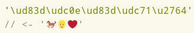

# ИНСТРУКЦИЯ К СКРИПТУ nodereplacer.js

### Содержание инструкции:

* **Общий раздел**
* [Замены](replacer.md)
* [Дополнительные плагины](#placeholder)
* [Раздел для программистов](#placeholder)

ОБЩИЙ РАЗДЕЛ


Для запуска скрипта необходимо чтобы на вашем компьютере была установлена программная платформа [Node.js](https://ru.wikipedia.org/wiki/Node.js) версии желательно не ниже **9.7.0**
Если не установлена, то берём [здесь](https://nodejs.org/).


Список замен и входной файл должны иметь кодировку UTF8 (с BOM или без) или UTF16LE (обязательно с BOM).


Если nodereplacer.js прекращает работу с сообщением, которое содержит "`out of memory`", такое может произойти при обработке очень больших файлов (если обработка сопровождается чтением всего входного файла в оперативную память), то можно попробовать запуск скрипта с ключом `--max_old_space_size=4096`
Отредактируйте для этого файл rep.bat, должно быть так:
`node --max_old_space_size=4096 --harmony_regexp_lookbehind --harmony_regexp_property...`
Значение ключа может быть и другим, в приведённом примере 4096 означает 4 гигабайта.

## Содержание раздела:

1. [Замены в файле имеющем словарную структуру (DSL).](#1-node-nodereplacerjs--rd-listtxt-inputtxt-outputtxt)
2. [Замены в файле не имеющем словарную структуру.](#2-node-nodereplacerjs--rt-re-listtxt-inputtxt-outputtxt)
3. [Замены в файле в формате GLS.](#3-node-nodereplacerjs--rg-listtxt-inputtxt-outputtxt)
4. [Замены между указанными DSL тегами.](#4-node-nodereplacerjs--rs-listtxt--a-za-z110-inputtxt-outputtxt)
5. [Конвертирование словарей формате в GLS в формат StarDict и обратно.](#5-node-nodereplacerjs-inputglsoutputifo)
6. [Исправление ошибок форматирования в DSL файле.](#6-node-nodereplacerjs--ctags-inputtxt-outputtxt)
7. [Удаление дубликатов статей (DSL).](#7-node-nodereplacerjs--d-inputtxt-outputtxt)
8. [Объединение статей с одинаковыми заголовками (DSL).](#8-node-nodereplacerjs--m--aa1a2ll1l2rr1r2-inputtxt-outputtxt)
9. [Складывание заголовков в стопы (DSL).](#9-node-nodereplacerjs--pile-inputtxt-outputtxt)
10. [Маркировка подвешенных ссылок (DSL).](#10-node-nodereplacerjs--susp-inputtxt-outputtxt)
11. [Получение списка всех символов.](#11-node-nodereplacerjs--symb-symb--f-inputtxt-outputtxt)
12. [Сортировка (DSL).](#12-node-nodereplacerjs--sort--bobibieoioiebdodbdcodc-inputtxt-outputtxt)
13. [Пользовательская сортировка (DSL).](#13-node-nodereplacerjs--usort-usort--i-inputtxt-outputtxt)
14. [Сортировка DSL тегов.](#14-node-nodereplacerjs--stags-inputtxt-outputtxt)
15. [Внедрение картинок в HTML файл.](#15-node-nodereplacerjs--base64--i-base64-inputtxt-outputtxt)
16. [Раскрытие круглых скобок в заголовках словарных исходников.](#16-node-nodereplacerjs--rb--dsl1dsl2dslm1dslm2glsglsm-inputtxt-outputtxt)
17. [Получение списка HTML тегов.](#17-node-nodereplacerjs--t-inputtxt-outputtxt)
18. [Выявление ошибок в словарях в формате DSL.](#18-node-nodereplacerjs--chkdsl-chkdsl--t-inputtxt-outputtxt)
19. [Объединение статей в словарях в формате GLS.](#19-node-nodereplacerjs--mgls-inputtxt-outputtxt)
20. [Дополнение](#Дополнение)

## Варианты командной строки:

1. [node nodereplacer.js -rd list input.txt output.txt](#1-node-nodereplacerjs--rd-listtxt-inputtxt-outputtxt)
2. [node nodereplacer.js (-rt|-re) list input.txt output.txt](#2-node-nodereplacerjs--rt-re-listtxt-inputtxt-outputtxt)
3. [node nodereplacer.js -rg list input.txt output.txt](#3-node-nodereplacerjs--rg-listtxt-inputtxt-outputtxt)
4. [node nodereplacer.js -rs list -\[A-Za-z\]{1,10} input.txt output.txt](#4-node-nodereplacerjs--rs-listtxt--a-za-z110-inputtxt-outputtxt)
5. [node nodereplacer.js (input.gls|input.ifo)](#5-node-nodereplacerjs-inputglsoutputifo)
6. [node nodereplacer.js -ctags input.txt output.txt](#6-node-nodereplacerjs--ctags-inputtxt-outputtxt)
7. [node nodereplacer.js -d input.txt output.txt](#7-node-nodereplacerjs--d-inputtxt-outputtxt)
8. [node nodereplacer.js -m -(a|a1|a2|l|l1|l2|r|r1|r2) input.txt output.txt](#8-node-nodereplacerjs--m--aa1a2ll1l2rr1r2-inputtxt-outputtxt)
9. [node nodereplacer.js -pile input.txt output.txt](#9-node-nodereplacerjs--pile-inputtxt-outputtxt)
10. [node nodereplacer.js -susp input.txt output.txt](#10-node-nodereplacerjs--susp-inputtxt-outputtxt)
11. [node nodereplacer.js (-symb|-symb -f) input.txt output.txt](#11-node-nodereplacerjs--symb-symb--f-inputtxt-outputtxt)
12. [node nodereplacer.js -sort -(b|o|bi|bie|oi|oie|bd|od|bdc|odc) input.txt output.txt](#12-node-nodereplacerjs--sort--bobibieoioiebdodbdcodc-inputtxt-outputtxt)
13. [node nodereplacer.js (-usort|-usort -i) input.txt output.txt](#13-node-nodereplacerjs--usort-usort--i-inputtxt-outputtxt)
14. [node nodereplacer.js -stags input.txt output.txt](#14-node-nodereplacerjs--stags-inputtxt-outputtxt)
15. [node nodereplacer.js (-base64 -i|-base64) input.txt output.txt](#15-node-nodereplacerjs--base64--i-base64-inputtxt-outputtxt)
16. [node nodereplacer.js -rb -(dsl1|dsl2|dslm1|dslm2|gls|glsm) input.txt output.txt](#16-node-nodereplacerjs--rb--dsl1dsl2dslm1dslm2glsglsm-inputtxt-outputtxt)
17. [node nodereplacer.js -t input.txt output.txt](#17-node-nodereplacerjs--t-inputtxt-outputtxt)
18. [node nodereplacer.js (-chkdsl|-chkdsl -t) input.txt output.txt](#18-node-nodereplacerjs--chkdsl-chkdsl--t-inputtxt-outputtxt)
19. [node nodereplacer.js -mgls input.txt output.txt](#19-node-nodereplacerjs--mgls-inputtxt-outputtxt)

## Назначение и использование:

###### 1) node nodereplacer.js -rd list.txt input.txt output.txt
Замены в файле имеющем [словарную структуру](#1) используя список замен (**_list.txt_**).

###### 2) node nodereplacer.js (-rt|-re) list.txt input.txt output.txt
Замены в файле **не** имеющем словарную структуру используя список замен (**_list.txt_**).</br>
С ключом -**_rt_** входной файл читается и обрабатываться построчно.</br>
С ключом -**_re_** (_read entire file_) данные из входного файла сначала полностью считываются в оперативную память компьютера и затем обрабатываются целиком, а не построчно или постатейно.

###### 3) node nodereplacer.js -rg list.txt input.txt output.txt
Замены в файле в формате [GLS](#2) используя список замен (**_list.txt_**).

###### 4) node nodereplacer.js -rs list.txt -[A-Za-z]{1,10} input.txt output.txt
Замены между указанными DSL тэгами.</br>
Входной файл должен иметь словарную структуру.</br>
Допустимые теги: [b], [i], [u], [c], [sup], [sub], [m], [p], [t], [ex], [com], [trn], [s], [video], [preview], [ref], [url]

Примеры командной строки:</br>
[b] - _node nodereplacer.js -rs list.txt -b input.txt output.txt_</br>
[com] - _node nodereplacer.js -rs list.txt -com input.txt output.txt_

[Подробности по заменам на отдельной странице.](#placeholder)

###### 5) node nodereplacer.js (input.gls|output.ifo)
Конвертирование словарей формате GLS в формат StarDict и обратно.</br>
Поддерживается только [sametypesequence=h](./../StarDictFileFormat.txt)

Варианты командной строки:</br>
node nodereplacer.js словарь.gls</br>
node nodereplacer.js словарь.ifo

Направление конвертирования определяется расширением файла в единственном аргументе.

[DICTZIP](http://linuxcommand.org/man_pages/dictzip1.html)</br>
Если на **Linux** имеется dictzip (`/usr/bin/dictzip`), то после конвертирования (GLS->StarDict) скрипт сожмёт созданный .dict файл используя эту утилиту.

[dictzip.exe](https://github.com/Tvangeste/dictzip-win32/releases) для **Windows** можно найти в архиве со скриптом.</br>
Перенесите его папку `C:\Windows\System32\`

CREDITS: [vsemozhetbyt](https://gist.github.com/vsemozhetbyt)</br>
Для написания плагина использовался [gls\_sd\_conv.js](https://gist.github.com/vsemozhetbyt/2b92014cd65e8fb3c3e5c0897a750e40) (версия после ревизии, которая была слелана [14.04.2017](https://gist.github.com/vsemozhetbyt/2b92014cd65e8fb3c3e5c0897a750e40/revisions))

###### 6) node nodereplacer.js -ctags input.txt output.txt
Исправление некоторых ошибок форматирования словарей в формате DSL.</br>
Входной файл должен иметь словарную структуру.

Пример:

_До_)
```
заголовок
        [c yellow] [i] [i] [/i] [/i] [/p] [c red] [c blue] [/c] [/c] [/c] [/i] [u] [c red]
заголовок
        [c red] [c blue] [/c]
заголовок
        [/c] [c red] [c blue] [/c]
заголовок
        [i] [/i] [/i]
        [u] [i] [i] [u] [/u] [/i] [/i] [/u]
        [i] [i] [/i] [i] [/i] [/i]
        [c red] [/c] [/c]
        [c red] [c blue] [/c] [/c]
заголовок
        [lang id=2] [lang id=4] [/lang]
        [lang name="Russian"] [lang name="Russian"] [/lang]
        [lang name="Russian"] [lang id=10] [/lang]
        [lang name="Russian"] [lang name="Russian"] [/lang]
        [sup] [sup]
        [u] [u] [/u] [/u]
        ['] [/'] [/']
        [c] [c blue] [/c] [/c]
заголовок
        [c blue] dog [c red] pig [/c] [c] cat [/c] cow [/c] end
        [c blue] dog [c red] pig [/c] [c] cat [/c] cow end
        [c blue] dog [c red] pig [c] cat [/c] cow [/c] end
        [i] 1 [i] 2 [i] 3 [/i] 4 [/i] 5 [/i] end
        [i] 1 [i] 2 [i] 3 [/i] 4 [/i] 5 end
        [!trs] 1 [!trs] 2 [/!trs] 3 [/!trs] end
        [ex] 1 [ex] 2 [/ex] 3 [/ex] end
        [trn] 1 [trn] 2 [/trn] 3 [/trn] end
```
_После_)
```
заголовок
        [c yellow] [i] [/i][i] [/i][i] [/i] {{[/p]}} [/c][c red] [/c][c blue] [/c][c red] [/c][c yellow] [/c] {{[/i]}} {{[u]}} {{[c red]}}
заголовок
        {{[c red]}} [c blue] [/c]
заголовок
        {{[/c]}} {{[c red]}} [c blue] [/c]
заголовок
        [i] [/i] {{[/i]}}
        [u] [i] [/i][i] [/u][u] [/u][u] [/i][i] [/i] [/u]
        [i] [/i][i] [/i][i] [/i][i] [/i][i] [/i]
        [c red] [/c] {{[/c]}}
        [c red] [/c][c blue] [/c][c red] [/c]
заголовок
        {{[lang id=2]}} [lang id=4] [/lang]
        {{[lang name="Russian"]}} [lang name="Russian"] [/lang]
        {{[lang name="Russian"]}} [lang id=10] [/lang]
        {{[lang name="Russian"]}} [lang name="Russian"] [/lang]
        {{[sup]}} {{[sup]}}
        [u] [/u][u] [/u][u] [/u]
        ['] [/'] {{[/']}}
        [c] [/c][c blue] [/c][c] [/c]
заголовок
        [c blue] dog [/c][c red] pig [/c][c blue] [/c][c] cat [/c][c blue] cow [/c] end
        {{[c blue]}} dog [c red] pig [/c] [c] cat [/c] cow end
        {{[c blue]}} dog [c red] pig [/c][c] cat [/c][c red] cow [/c] end
        [i] 1 [/i][i] 2 [/i][i] 3 [/i][i] 4 [/i][i] 5 [/i] end
        {{[i]}} 1 [i] 2 [/i][i] 3 [/i][i] 4 [/i] 5 end
        [!trs] 1 [/trs][!trs] 2 [/!trs][!trs] 3 [/!trs] end
        [ex] 1 [/ex][ex] 2 [/ex][ex] 3 [/ex] end
        [trn] 1 [/trn][trn] 2 [/trn][trn] 3 [/trn] end
```
###### 7) node nodereplacer.js -d input.txt output.txt
Удаление из словаря дубликатов статей.</br>
Входной файл должен иметь словарную структуру.

Пример:

_До_)
```
dog
        собака
perro
        собака
dog
        собака
```
_После_)
```
dog
        собака
perro
        собака
```
Закомментированные части в заголовках игнорируются, в теле - нет.

Пример:

_До_)
```
dog
        собака
perro
        собака
dog{{комментарий}}
        собака
dog
        собака{{комментарий}}
```
_После_)
```
dog
        собака
perro
        собака
dog
        собака{{комментарий}}
```
_Удаленные дубликаты записываются в файл_ **dub.txt**

_Если входной файл содержит статьи с несколькими заголовками сложенными в стопы, то при обработке такие статьи будут разобраны._

Пример:

_До_)
```
dog
perro
        собака
```
_После_)
```
dog
        собака
perro
        собака
```
###### 8) node nodereplacer.js -m -(a|a1|a2|l|l1|l2|r|r1|r2) input.txt output.txt
Объединение в словаре разных статей с одинаковыми заголовками с предварительным удалением дубликатов статей.</br>
Входной файл должен иметь словарную структуру.

-**a** - _использовать в качестве разделителя **арабские** цифры._

-**l** - _использовать в качестве разделителя **линию**._

-**r** - _использовать в качестве разделителя **римские** цифры._

-**a1**, -**a2**, -**l1**, -**l2**, -**r1**, -**r2** - _обрабатывать заголовки с фигурными скобками (если перед ними нет обратного слэша)._

-**a1**, -**l1**, -**r1** - _в качестве заголовка для объединенной карточки берется самый КОРОТКИЙ заголовок._

-**a2**, -**l2**, -**r2** - _в качестве заголовка для объединенной карточки берется самый ДЛИННЫЙ заголовок._

Пример №1:

Командная строка:</br>
_node nodereplacer.js -m -**l** input.txt output.txt_

_До_)
```
собака
        dog
собака
        perro
dog
        собака
```
_После_)
```
собака
        dog
        ————————
        perro
dog
        собака
```
Пример №2:

Командная строка:</br>
_node nodereplacer.js -m -**l1** input.txt output.txt_

_До_)
```
111 {333} 222 {444}
        pig
111 222
        dog
111 {333} 222
        dog
111 222  
        dog
```
_После_)
```
111 222
        pig
        ————————
        dog
```
Пример №3:

Командная строка:</br>
_node nodereplacer.js -m -**l2** input.txt output.txt_

_До_)
```
111 {333} 222 {444}
        pig
111 222
        dog
111 {333} 222
        dog
111 222  
        dog
```
_После_)
```
111 {333} 222 {444}
        pig
        ————————
        dog
```
_Удаленные дубликаты записываются в файл **dub.txt**_

_Если входной файл содержит статьи с несколькими заголовками сложенными в стопы, то при обработке такие статьи будут разобраны._

Закомментированные части в заголовках игнорируются, в теле - нет.

Пример:

_До_)
```
dog
        собака
dog{{комментарий}}
        собака
dog
        собака{{комментарий}}
```
_После_)
```
dog
        собака
        ————————
        собака{{комментарий}}
```
###### 9) node nodereplacer.js -pile input.txt output.txt
Объединение статей в словаре имеющих одинаковое тело со складыванием заголовков в стопы.</br>
Входной файл должен иметь словарную структуру.

Пример:

_До_)
```
perro
        собака
dog
        собака
cane
        собака
```
_После_)
```
perro
dog
cane
        собака
```
###### 10) node nodereplacer.js -susp input.txt output.txt
Маркировка подвешенных ссылок в DSL файле.</br>
Входной файл должен иметь словарную структуру.

Пример:

_До_)
```
perro
        <<собака>> [ref]cane[/ref] <<pies>> <<dog>>
dog
        собака
cane
        собака
```
_После_)
```
perro
        <<$$$собака$$$>> [ref]cane[/ref] <<$$$pies$$$>> <<dog>>
dog
        собака
cane
        собака
```
Обратный слеш перед перед квадратными и круглыми скобками, пробелы и табуляторы на конце заголовка скриптом игнорируются.</br>
Т.е. к примеру, скрипт не будет маркировать ссылку `<<dog[s]>>` если имеется заголовок `dog\[s\]`.</br>

Круглые скобки в заголовках раскрываются, а {{текст}} и {текст} игнорируется.

Пример:

_До_)
```
dog{1}
{{комментарий}}
c{{комментарий}}at
кошка(ми)
   перевод
test
   <<dog>>
   [ref]cat[/test]
   <<проверка>>
   <<{{комментарий}}>>
   <<кошка>>
   [ref]кошками[/ref]
   [ref]кошка(ми)[/ref]
```
_После_)
```
dog{1}
{{мусор}}
c{{мусор}}at
кошка(ми)
   перевод
test
   <<dog>>
   [ref]cat[/test]
   <<$$$проверка$$$>>
   <<$$${{мусор}}$$$>>
   <<кошка>>
   [ref]кошками[/ref]
   [ref]$$$кошка(ми)$$$[/ref]
```
###### 11) node nodereplacer.js (-symb|-symb -f) input.txt output.txt
Получение списка всех символов в текстовом файле и некоторой информации об этих символах.

При использовании ключа -_**f**_ список сортируется по частотности.

Пример:

_До_)
```
 b
 🐵😻💩
 ccc
 aa
```
_После -**symb**_)

_node nodereplacer.js -symb input.txt output.txt_
```
        0020    32      SPACE   4
a       0061    97      LATIN SMALL LETTER A    2
b       0062    98      LATIN SMALL LETTER B    1
c       0063    99      LATIN SMALL LETTER C    3
🐵       1F435   128053  MONKEY FACE     1
💩       1F4A9   128169  PILE OF POO     1
😻       1F63B   128571  SMILING CAT FACE WITH HEART-SHAPED EYES 1
```
_После -**symb** -**f**_)

_node nodereplacer.js -symb -f input.txt output.txt_
```
        0020    32      SPACE   4
c       0063    99      LATIN SMALL LETTER C    3
a       0061    97      LATIN SMALL LETTER A    2
b       0062    98      LATIN SMALL LETTER B    1
🐵       1F435   128053  MONKEY FACE     1
💩       1F4A9   128169  PILE OF POO     1
😻       1F63B   128571  SMILING CAT FACE WITH HEART-SHAPED EYES 1
```
_Последняя колонка - частотность. Вторая - шестнадцатеричное значение символа_

###### 12) node nodereplacer.js -sort -(b|o|bi|bie|oi|oie|bd|od|bdc|odc) input.txt output.txt
Сортировка статей в DSL файле.

Внимание: Во всех режимах комментарии в заголовках игнорируются.

-**b** - _сортировать статьи по заголовкам с учетом содержимого тела карточки._

Пример:

_До_)
```
pig
        свинья 2
horse
        лошадь
dog
        собака
pig
        свинья 1
```
_После_)
```
dog
        собака
horse
        лошадь
pig
        свинья 1
pig
        свинья 2
```
-**o** - _сортировать статьи по заголовкам, но с сохранением оригинального порядка в блоке статей имеющих одинаковый заголовок._

Пример:

_До_)
```
pig
        свинья 2
horse
        лошадь
dog
        собака
pig
        свинья 1
```
_После_)
```
dog
        собака
horse
        лошадь
pig
        свинья 2
pig
        свинья 1
```
-**bi** - _сортировать статьи по заголовкам с учетом содержимого тела карточки_.</br>
_И при сортировке игнорировать в заголовках:_</br>
а) _фигурные скобки и все, что находится между ними_</br>
б) _обратный слэш перед символами_ `@#^~[]{}()`

Пример:

_До_)
```
pig
        свинья 2
horse
        лошадь
pig
        свинья 1
{[i]}d{[/i]}og
        собака
```
_После_)
```
{[i]}d{[/i]}og
        собака
horse
        лошадь
pig
        свинья 1
pig
        свинья 2
```
-**bie** - _это расширенный вариант -**bi**_.</br>
_При сортировке игнорируются также_:</br>
а) _символы: «»"„“”‘’…_</br>
б) _многоточие из обычных точек (это помимо Horizontal ellipsis (U+2026))_</br>
в) _диакритические знаки в символах_ ё _и_ Ё.</br>
г) _круглые скобки и все, что находится между ними_

-**oi** - _сортировать статьи по заголовкам, но с сохранением оригинального порядка в блоке статей имеющих одинаковый заголовок_.</br>
_И при сортировке игнорировать в заголовках_:</br>
а) _фигурные скобки и все, что находится между ними_</br>
б) _обратный слэш перед символами_ `@#^~[]{}()`

Пример:

_До_)
```
pig
        свинья 2
horse
        лошадь
pig
        свинья 1
{[i]}d{[/i]}og
        собака
```
_После_)
```
{[i]}d{[/i]}og
        собака
horse
        лошадь
pig
        свинья 2
pig
        свинья 1
```
-**oie** - _это расширенный вариант -**oi**_.</br>
_При сортировке игнорируются также_:</br>
а) _символы_: «»"„“”‘’…</br>
б) _многоточие из обычных точек (это помимо Horizontal ellipsis (U+2026))_</br>
в) _диакритические знаки в символах_ ё _и_ Ё.</br>
г) _круглые скобки и все, что находится между ними_

-**bd** - _то же самое, что и -**b**, но с игнорированием диакритических знаков в заголовках_</br>
Входной файл должен иметь словарную структуру.

Пример:

_До_)
```
z
        aaa
e
        aaa2
ø
        aaa
p
        aaa
å
        aaa
é
        aaa1
d
        aaa
```
_После_)
```
å
        aaa
d
        aaa
é
        aaa1
e
        aaa2
ø
        aaa
p
        aaa
z
        aaa
```
-**od** - _то же самое, что и -o, но с игнорированием диакритических знаков в заголовках_</br>
Входной файл должен иметь словарную структуру.

Пример:

_До_)
```
z
        aaa
e
        aaa2
ø
        aaa
p
        aaa
å
        aaa
é
        aaa1
d
        aaa
```
_После_)
```
å
        aaa
d
        aaa
e
        aaa2
é
        aaa1
ø
        aaa
p
        aaa
z
        aaa
```
-**bdc** - _то же самое, что и -bd, но с игнорированием регистра_</br>
Входной файл должен иметь словарную структуру.

Пример:

_До_)
```
mⱥlta 2
        aaa
Mḁlta 3
        aaa
MÀLTA 1
        aaa
```
_После_)
```
MÀLTA 1
        aaa
mⱥlta 2
        aaa
Mḁlta 3
        aaa
```
-**odc** - _то же самое, что и -**od**, но с игнорированием регистра_</br>
Входной файл должен иметь словарную структуру.

###### 13) node nodereplacer.js (-usort|-usort -i) input.txt output.txt
Пользовательская сортировка.
Входной файл должен иметь словарную структуру (в формате [DSL](#1)).</br>
Файл с правилами сортировки **_sortRules.txt_** должен лежать в одной папке со скриптом. Его наличие опционально.

Следующие символы скрипт из **_sortRules.txt_** удаляет:</br>
`\x20\f\n\r\t\v\u00a0\u1680\u180e\u2000-\u200a\u2028\u2029\u202f\u205f\u3000\ufeff`

Статьи сортируются только по заголовкам и с сохранением оригинального порядка в блоке статей имеющих одинаковый заголовок. При сортировке тело статей не учитывается.

-**i** - _Чтобы скрипт не выделял статьи с заголовками, которые начинаются на заглавные буквы в отдельные блоки (сортировать с игнорированием регистра)._

Пример (Обратная сортировка):

Командная строка:</br>
_node nodereplacer.js -**usort** -**i** input.txt output.txt_

Содержание sortRules.txt:</br>
zyxwvutsrqponmlkjihgfedcba

_До_)
```
zebra
        перевод
dog
        перевод
pig
        перевод
```
_После_)
```
zebra
        перевод
pig
        перевод
dog
        перевод
```
Чтобы статьи у которых заголовки начинаются с буквы с диакритическим знаком не оказывались после статей заголовки которых начинаются на последнюю букву алфавита можно использовать **sortRules.txt** с таким содержанием:

`aàâbcçdeéèêëfghiîïjklmnoôpqrstuùûüvwxyÿz`

Для турецкого языка:

`AaBbCcÇçDdEeFfGgĞğHhIıİiJjKkLlMmNnOoÖöPpRrSsŞşTtUuÜüVvYyZz`

Скрипт должен правильно работать с многобайтными символами Юникода:



###### 14) node nodereplacer.js -stags input.txt output.txt
Сортировка DSL тегов.
Входной файл должен иметь словарную структуру.</br>

Скрипт сначала сортирует открывающие теги в зависимости от положения закрывающих тегов.</br>
Потом сортирует закрывающие теги в зависимости от положения открывающих тегов.

Некоторые DSL теги скрипт игнорирует:</br>
`\[(?:(?:(?:br|[stm]|m\d|url|video|preview|ref)|ref\x20[^\r\n\]]+)|\/(?:[stm]|ref|url|video|preview))\]`

Пример:

_До_)
```
заголовок
        [m1][p][i][c][com]сокр.[/i][/p] от [ref]them[/ref]; [p][i]разг.[/com][/c][/i][/p][/m]  
        [m1][p][i][c][com]гл.[/i][/p]; [p][i]сокр.[/i][/p]; [p][i]разг.[/com][/c][/i][/p][/m]  
        [m1][p][i][c][com]сокр.[/i][/p] от [lang id=1033]it was; [p][i]уст.[/i][/p]; [p][i]поэт.[/lang][/com][/c][/i][/p][/m]
```
_После_)
```
заголовок
        [m1][c][com][p][i]сокр.[/i][/p] от [ref]them[/ref]; [p][i]разг.[/i][/p][/com][/c][/m]  
        [m1][c][com][p][i]гл.[/i][/p]; [p][i]сокр.[/i][/p]; [p][i]разг.[/i][/p][/com][/c][/m]  
        [m1][c][com][p][i]сокр.[/i][/p] от [lang id=1033]it was; [p][i]уст.[/i][/p]; [p][i]поэт.[/i][/p][/lang][/com][/c][/m]
```
###### 15) node nodereplacer.js (-base64 -i|-base64) input.txt output.txt
**а**) Внедрение картинок в HTML файл (-**_base64_** -**_i_**).</br>
Наличие словарной структуры у входного файла не обязательно.</br>
Картинки должны находиться в папке "res", а папка "res" в одной папке с входным файлом.</br>
Атрибуты src тегов IMG во входном файле должны содержать только имена файлов.

Пример 1:
```html
 - правильно.
 - неправильно, недопустимо.
```
Пример 2:

_До_)
```html

```
_После_)
```html

```
Информация о ненайденных картинках пишется в файл _**error.log**_

**б**) Конвертирование одной картинки (-**_base64_**).

Пример:

Командная строка:</br>
_node nodereplacer.js -base64 input.png output.txt_

Результат (output.txt):
```html


<style>
div.image {
background-image:url(data:image/png;base64,iVBORw0KGg...);
background-size: auto;
background-repeat: no-repeat;
width:100%;
height:100%;

}
</style>

<div class=image title="input.png"></div>
```
###### 16) node nodereplacer.js -rb -(dsl1|dsl2|dslm1|dslm2|gls|glsm) input.txt output.txt
Раскрытие круглых скобок в заголовках словарных исходников.</br>
Входной файл должен иметь словарную структуру.

-**dsl1** и -**dsl2** - _для обработки словарей в формате_ [DSL](#1)

_Разница между -dsl1 и -dsl2 будет показана ниже._

-**dslm1** и -**dslm2** - _то же самое, отличие только в том, что созданные при раскрытии круглых скобок заголовки будут маркироваться с помощью метки $$$_.

-**gls** - _для обработки словарей в формате_ [GLS](#2)

-**glsm** - _маркировка_

DSL

Пример:

Командная строка:</br>
_node nodereplacer.js -**rb** -**dsl1** input.txt output.txt_

_До_)

```
(за)кончить(ся)
        перевод
кошка(ми)
собака\(ми\)
        перевод
кот{(}ы{)}
        перевод
свинья{(ми)}
        перевод
свинья\{(ми)\}
        перевод
овца{{(ми)}}
        перевод
```
_После_)
```
кончиться
закончить
закончиться
кончить
        перевод
кошками
кошка
        перевод
собака\(ми\)
        перевод
кот{(}ы{)}
        перевод
свинья{(ми)}
        перевод
свинья\{ми\}
свинья\{\}
        перевод
овца{{(ми)}}
        перевод
```
**Пояснение к примеру**:

* Экранированные круглые скобки игнорируются.
* Скрипт умеет работать с заголовками сложенными в стопку.
* Скрипт не раскрывает круглые скобки если они находятся между двойными или одинарными неэкранированными фигурными скобками.

РАЗЛИЧИЕ МЕЖДУ -dsl1 и -dsl2

Пример:

Командная строка:</br>
_node nodereplacer.js -**rb** -**dsl2** input.txt output.txt_

_До_)
```
(за)кончить(ся)
        перевод
После -dsl1)

кончиться
закончить
закончиться
кончить
        перевод 
После -dsl2)

{(за)}кончить{(}ся{)}
        перевод
{(}за{)}кончить{(ся)}
        перевод
{(}за{)}кончить{(}ся{)}
        перевод
{(за)}кончить{(ся)}
        перевод
```
GLS

Пример:

Командная строка:</br>
_node nodereplacer.js -**rb** -**gls** input.txt output.txt_

_До_)
```
### Glossary title: Имя словаря
### Author: Имя автора
### Description: описание
### Source language: Russian
### Target language: Russian
### Glossary section:

кот|кот(ами)|кот(ами)
перевод

кошка\(ми\)
перевод

собака(ми)
перевод

(за)кончить(ся)
перевод
```
_После_)
```
### Glossary title: Имя словаря
### Author: Имя автора
### Description: описание
### Source language: Russian
### Target language: Russian
### Glossary section:

кот|котами
перевод

кошка\(ми\)
перевод

собака|собаками
перевод

кончить|кончиться|закончить|закончиться
перевод
```
**Пояснение к примеру**:

* Экранированные круглые скобки игнорируются.
* Дубликаты из списка заголовков удаляются.
  При этом сохраняются заголовки, которые находятся в начале строки.
  Пример: до) кот|котами|кот => после) кот|котами (а не котами|кот)

###### 17) node nodereplacer.js -t input.txt output.txt
Получение списка HTML тэгов.</br>
Наличие словарной структуры у входного файла не обязательно.

###### 18) node nodereplacer.js (-chkdsl|-chkdsl -t) input.txt output.txt
Выявление ошибок в словарях в формате DSL.</br>
Входной файл должен иметь словарную структуру.

[Подробнее на отдельной странице](#placeholder).

###### 19) node nodereplacer.js -mgls input.txt output.txt
Объединение статей в словарях в формате GLS.</br>
Входной файл должен быть в формате [GLS](#2).

Пример:

_До_)
```
пёс|собака
тело1

барбос
тело1

пёс|собака
тело2

барбос|тузик
тело1

барбос|пёс
тело2

пёс|собака
тело2

барбос|тузик
тело1
```

_После_)
```
пёс|собака|барбос|тузик
тело1

пёс|собака|барбос
тело2
```

Аварийная остановка - Ctrl+C

## Дополнение:

На **Windows** скрипт будет удобнее запускать если создать batch файл (rep.bat) с таким содержанием:
```
@ECHO OFF
if "%1" == "-h" (
        start firefox.exe C:\U\nodereplacer\help\index.htm 
) ELSE (
        node --harmony_regexp_lookbehind C:\U\nodereplacer\nodereplacer.js %*
        pause
)
```
Этот файл нужно поместить в папку `C:\Windows\System32\` и отредактировать пути если нужно.

Можно также заменить "**_firefox.exe_**" на другой браузер.

После этого скрипт можно будет запускать из любого места используя такую командную строку:

_**rep -rt list input.txt output.txt**_

Вызов справки: _**rep -h**_

Вариант для **Linux**:
```bash
function nodereplacer()
{
clear
if [[ $# -eq 1 ]] && [[ "$1" == "-h" ]]; then
        (firefox полный_путь/help/index.htm >/dev/null 2>&1 &)
else
        node --harmony_regexp_lookbehind --harmony_regexp_property полный_путь/nodereplacer.js "$@"
        echo ''
        echo "$(tput sgr 0)$(tput setaf 3)Press Enter to return$(tput sgr 0)"
        read input
fi      
}


alias rep=nodereplacer
```
Вышеприведенный код нужно добавить в **_.bashrc_** файл.

## Сноски

###### 1
Файл имеющий словарную структуру (формат DSL) - _это файл в котором заглавные слова пишутся с первой позиции новой строки, а начиная со следующей строки после заголовка записывается тело статьи, причем каждая строка в нем должна отступать от первой позиции хотя бы на один пробел или табуляцию. Тело статьи простирается до заголовка следующей статьи (признаком его является символ в первой позиции, отличный от пробела или табуляции) или до конца файла. Между телом одной и заголовком следующей статьи для удобства чтения исходного текста могут быть вставлены одна или несколько пустых строк._

###### 2
Формат GLS (Babylon glossary file):
```
 ПРИМЕР СЛОВАРЯ В ФОРМАТЕ GLS 
 
 ### Glossary title: Имя словаря
 ### Author: Имя автора
 ### Description: описание
 ### Source language: English
 ### Target language: English
 ### Glossary section:

 cat
 Definition

 dog
 Definition

 --------------------

 ОПИСАНИЕ ФОРМАТА GLS

 [блок директив]
 [пустая строка]
 заголовок
 определение
 [пустая строка]
 заголовок1|заголовок2|заголовок3...
 определение
 [пустая строка]
 ...

 1. В начале файла пустая строка факультативна.
 2. Блок директив факультативен.
 3. Блок директив и следующие за ним статьи должны быть разделены хотя бы одной пустой строкой.
 4. Статья - это две следующих одна за другой непустые строки, которые не являются частью блока директив. 
    И которые отделены от предшествующей и следующей непустой строки хотя бы одной пустой строкой.
 5. Меньше или больше двух непустых строк между пустыми ошибочно.
 6. Пустые строки в конце файла факультативны.  

```
