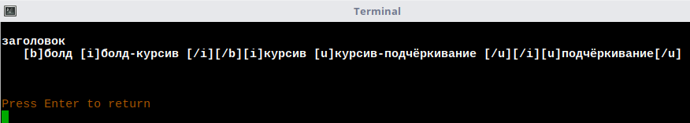

# ИНСТРУКЦИЯ К СКРИПТУ nodereplacer.js

### Содержание инструкции:

* [Установка](install.md)
* [Общий раздел](index.md)
* [Замены](replacer.md)
* [Дополнительные плагины](plugins.md)
* [Раздел для программистов](javascript.md)
* **Тестирование**


ТЕСТИРОВАНИЕ

Пример №1:

Командная строка: **_rep test.js_**

Содержание **_test.js_**:
```javascript
s = String.raw`
заголовок
   [b]болд [i]болд-курсив [/b]курсив [u]курсив-подчёркивание [/i]подчёркивание[/u]

`;


fs.writeFileSync('/tmp/u/temp_in.txt', s, {encoding: 'utf8', flag: "w"});


const exec = require('child_process').execSync;
exec('node --harmony_regexp_lookbehind /home/andrey/u/tools/scripts/js/nodereplacer/nodereplacer.js -retag /tmp/u/temp_in.txt /tmp/u/temp_out.txt', (error, stdout, stderr) => {

  if (error) {
    console.error(`exec error: ${error}`);
    return;
  }

});


s = fs.readFileSync('/tmp/u/temp_out.txt', 'utf8').toString();

console.log(s);

//Подчищаем
fs.unlinkSync('/tmp/u/temp_in.txt')
fs.unlinkSync('/tmp/u/temp_out.txt')
```
Результат:



Пример №2:

Командная строка: **_rep test.js_**

Содержание **_test.js_**:
```javascript
s = String.raw`

поговорка
<h4 L=0 title="поговорка" id=поговорка></h4>
<pos=S>
<p><b>ПОГОВО'РКА</b>, и, <i>ж.</i>
<b>1.</b>
<span class=sem>Принятое, ходячее выражение, обычно образное, иносказательное, не являющееся цельной фразой, предложением (чем отличается от пословицы, напр. ни пава ни ворона).</span>
<b>2.</b>
<span class=sem>То же, что <a href="../16/us363012.htm">пословица</a> (неточно).</span>
<b>3.</b>
<i>только ед.</i>
<span class=sem>Разговоры, толки (обл.).</span>
<span class=sample><i>Была об этом п.</i></span>
<b>4.</b>
<span class=sem>Говор, произношение (обл.).</span>
<span class=sample><i>Ардатовца всегда по поговорке узнаешь.</i> Даль.</span>
<b>5.</b>
<span class=sem>Слово, часто вставляемое в речь кстати и некстати, напр. знаешь, значит, того и т. п. (простореч.).</span>

`;


\s*<h4 L=0 title="поговорка" id=поговорка></h4>     ||      
\s*<pos=S>        ||      
let $ = init_cheerio(s, {decodeEntities: false, normalizeWhitespace: false});
$('p').reptag('', '');
$('b').reptag('[b]', '[/b]');
$('i').reptag('[i]', '[/i]');
$('a').reptag('[ref]', '[/ref]');
$('span.sem').reptag('[c darkslategray]', '[/c]');
$('span.sample').reptag('[*][ex]', '[/ex][/*]');
s = $.html();
^([\t\x20]+)([^\t\x20].*)$ || $1[m1]$2[/m]
console.log(s);
```
Результат:
```
поговорка
	[m1][b]ПОГОВО'РКА[/b], и, [i]ж.[/i][/m]
	[m1][b]1.[/b][/m]
	[m1][c darkslategray]Принятое, ходячее выражение, обычно образное, иносказательное, не являющееся цельной фразой, предложением (чем отличается от пословицы, напр. ни пава ни ворона).[/c][/m]
	[m1][b]2.[/b][/m]
	[m1][c darkslategray]То же, что [ref]пословица[/ref] (неточно).[/c][/m]
	[m1][b]3.[/b][/m]
	[m1][i]только ед.[/i][/m]
	[m1][c darkslategray]Разговоры, толки (обл.).[/c][/m]
	[m1][*][ex][i]Была об этом п.[/i][/ex][/*][/m]
	[m1][b]4.[/b][/m]
	[m1][c darkslategray]Говор, произношение (обл.).[/c][/m]
	[m1][*][ex][i]Ардатовца всегда по поговорке узнаешь.[/i] Даль.[/ex][/*][/m]
	[m1][b]5.[/b][/m]
	[m1][c darkslategray]Слово, часто вставляемое в речь кстати и некстати, напр. знаешь, значит, того и т. п. (простореч.).[/c][/m]
```
<hr>
